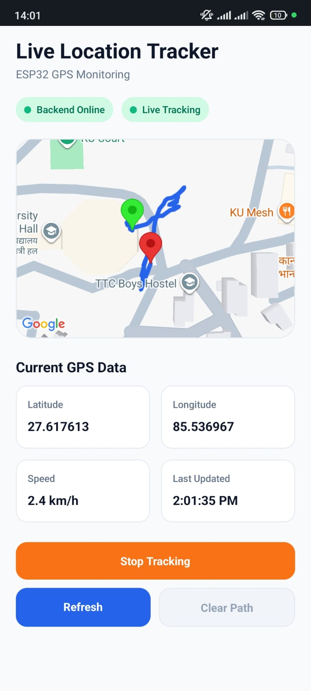
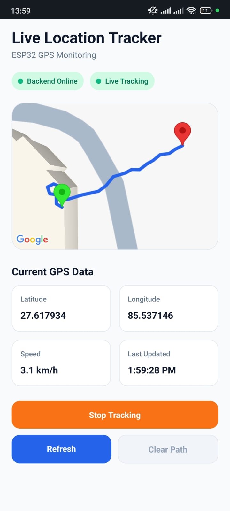
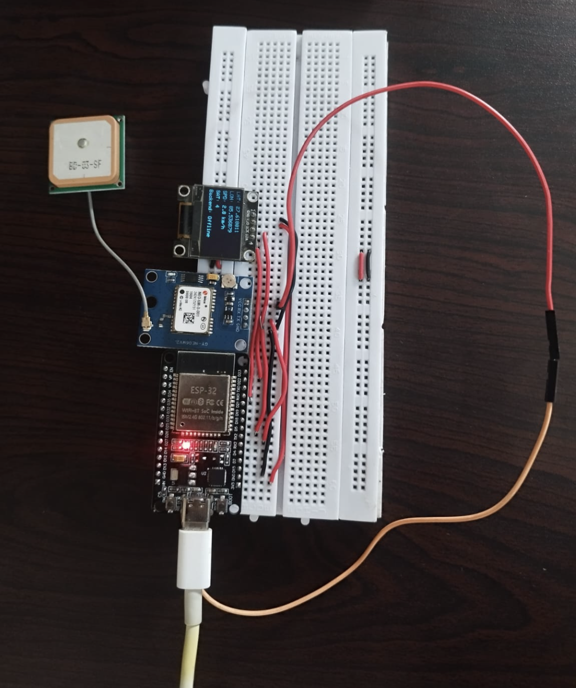

# Live Location Tracker

A real-time IoT GPS tracking system built with an **ESP32**, **NEO-6M GPS module**, **SSD1306 OLED display**, **FastAPI**, **SQLite**, and a **React Native Expo mobile application**.

The ESP32 reads GPS data, applies quality and movement filtering, and sends accepted location points to the FastAPI backend through HTTP requests. The backend stores the data in SQLite and broadcasts new locations to the mobile application through WebSocket communication.

The mobile application displays the latest tracker position and draws the travelled route during an active tracking session.

---

## Project Overview

The Live Location Tracker is designed to track a person carrying an ESP32-based GPS device.

The project demonstrates the integration of:

- Embedded-system development
- GPS data processing
- Wi-Fi communication
- REST API communication
- WebSocket-based live updates
- Database storage
- Mobile application development
- Real-time map visualization

---

## Demo Screenshots

<p align="center">
  
  &nbsp;&nbsp;
  
</p>

<p align="center">
  <em>Mobile application showing tracked locations and travelled routes.</em>
</p>

---

## System Architecture

```text
NEO-6M GPS Module
        │
        │ UART Serial Data
        ▼
      ESP32
        │
        │ Wi-Fi
        │ HTTP POST
        ▼
 FastAPI Backend
        │
        ├── SQLite Database
        │
        └── WebSocket
                │
                ▼
      React Native Mobile App
```

The ESP32 acts as an **HTTP client**, while the FastAPI application running on the laptop acts as the **server**.

---

## How the System Works

1. The NEO-6M GPS module receives location information from GPS satellites.
2. The GPS module sends digital NMEA data to the ESP32 through UART communication.
3. The ESP32 extracts latitude, longitude, speed, satellite count, and HDOP using TinyGPSPlus.
4. The ESP32 validates GPS quality and filters inaccurate or unrealistic movement.
5. Accepted location data is sent to the FastAPI backend through an HTTP POST request.
6. The backend stores the location in SQLite.
7. The backend broadcasts the new location through WebSocket.
8. The mobile application receives the new location and updates the map.
9. During tracking, the application draws the travelled route in real time.

---

## Main Features

### Mobile Application

- Displays the latest ESP32 tracker location
- Shows one marker when the application opens
- Does not draw previous route history during startup
- Starts a new route when **Start Tracking** is pressed
- Uses the latest location as the route starting point
- Receives live locations through WebSocket
- Draws the travelled route in real time
- Keeps the completed route visible after tracking stops
- Clears the route using **Clear Path**
- Preserves the latest-location marker after clearing
- Displays speed only during active tracking
- Shows backend and live-tracking connection status
- Supports manual refresh
- Displays the last-updated time in Nepal time

### ESP32 Tracker

- Connects to Wi-Fi
- Automatically attempts Wi-Fi reconnection
- Checks backend availability
- Reads GPS data through UART
- Processes fresh GPS fixes
- Uses GPS speed-over-ground when valid
- Calculates coordinate-based speed as a fallback
- Uses stationary and moving states
- Filters GPS drift
- Rejects weak GPS quality
- Rejects unrealistic position jumps
- Smooths speed values
- Requires consecutive readings to confirm movement
- Requires consecutive low-movement readings to confirm stopping
- Sends accepted locations to the backend
- Sends a final `0.0 km/h` update when movement stops
- Displays GPS and connection information on the OLED

### Backend

- FastAPI REST API
- SQLite database
- SQLAlchemy ORM
- Location validation
- Location-history storage
- Latest-location retrieval
- Location deletion
- Backend health checking
- WebSocket broadcasting
- Automatic API documentation

---

## Hardware Components

- ESP32 development board
- NEO-6M GPS module
- SSD1306 OLED display
- Breadboard
- Jumper wires
- USB cable or portable power source
- Smartphone
- Laptop

---

## Hardware Setup

<p align="center">
  
</p>

<p align="center">
  <em>ESP32 connected to the NEO-6M GPS module and SSD1306 OLED display.</em>
</p>

---

## Hardware Connections

### NEO-6M GPS Module to ESP32

| GPS Module | ESP32      |
| ---------- | ---------- |
| VCC        | 3.3V or 5V |
| GND        | GND        |
| TX         | GPIO 16    |
| RX         | GPIO 17    |

The GPS module sends serial data through its `TX` pin to ESP32 GPIO `16`.

### SSD1306 OLED Display to ESP32

| OLED Display | ESP32   |
| ------------ | ------- |
| VCC          | 3.3V    |
| GND          | GND     |
| SDA          | GPIO 21 |
| SCL          | GPIO 22 |

OLED I2C address:

```text
0x3C
```

---

## Technology Stack

### Mobile Application

- React Native
- Expo
- Expo Router
- TypeScript
- NativeWind
- React Native Maps
- WebSocket

### Backend

- Python
- FastAPI
- SQLAlchemy
- SQLite
- Uvicorn
- WebSocket

### Embedded System

- ESP32
- Arduino framework
- PlatformIO
- TinyGPSPlus
- ArduinoJson
- Adafruit GFX
- Adafruit SSD1306

---

## Project Structure

```text
location-tracker/
│
├── assets/
│   ├── hardware.png
│   ├── demo1.png
│   └── demo2.png
│
├── client/
│   ├── app/
│   │   ├── _layout.tsx
│   │   └── index.tsx
│   ├── components/
│   │   ├── InfoCard.tsx
│   │   ├── StatusBadge.tsx
│   │   └── TrackerMap.tsx
│   ├── services/
│   │   ├── api.ts
│   │   └── socket.ts
│   ├── types/
│   │   └── location.ts
│   └── package.json
│
├── server/
│   ├── app/
│   │   ├── routes/
│   │   │   ├── __init__.py
│   │   │   └── locations.py
│   │   ├── __init__.py
│   │   ├── database.py
│   │   ├── main.py
│   │   ├── models.py
│   │   ├── schemas.py
│   │   └── websocket_manager.py
│   └── requirements.txt
│
├── esp32/
│   ├── include/
│   │   ├── api_client.h
│   │   ├── config.example.h
│   │   ├── config.h
│   │   └── location_filter.h
│   ├── src/
│   │   ├── api_client.cpp
│   │   ├── location_filter.cpp
│   │   └── main.cpp
│   └── platformio.ini
│
└── README.md
```

---

## Network Requirements

The laptop, ESP32, and smartphone must be connected to the same Wi-Fi network or mobile hotspot.

```text
Wi-Fi Router or Mobile Hotspot
        │
        ├── Laptop
        │     ├── FastAPI backend
        │     └── Expo development server
        │
        ├── ESP32 tracker
        │
        └── Smartphone
              └── Expo mobile application
```

The ESP32 sends data to the laptop IP address. It does not communicate directly with the mobile application.

---

## Backend Setup

Open a terminal in the project root:

```bash
cd server
```

Create and activate a Python virtual environment:

```bash
python3 -m venv venv
source venv/bin/activate
```

On Windows:

```bash
venv\Scripts\activate
```

Install dependencies:

```bash
pip install -r requirements.txt
```

Start the FastAPI backend:

```bash
uvicorn app.main:app --reload --host 0.0.0.0 --port 8000
```

Backend address:

```text
http://YOUR_LAPTOP_IP:8000
```

API documentation:

```text
http://YOUR_LAPTOP_IP:8000/docs
```

Health endpoint:

```text
http://YOUR_LAPTOP_IP:8000/health
```

---

## Mobile Application Setup

Open another terminal:

```bash
cd client
npm install
```

Create:

```text
client/.env
```

Add:

```env
EXPO_PUBLIC_SERVER_IP=YOUR_LAPTOP_IP
```

Start Expo:

```bash
npx expo start --clear
```

Open the application on a physical device using Expo Go.

---

## ESP32 Setup

Open the `esp32` folder as a PlatformIO project.

Create:

```text
esp32/include/config.h
```

Add:

```cpp
#ifndef CONFIG_H
#define CONFIG_H

#define WIFI_SSID "YOUR_WIFI_NAME"
#define WIFI_PASSWORD "YOUR_WIFI_PASSWORD"

#define SERVER_IP "YOUR_LAPTOP_IP"
#define SERVER_PORT 8000

#define DEVICE_ID "tracker_01"

#endif
```

Build and upload the firmware through PlatformIO.

Open the Serial Monitor at:

```text
115200 baud
```

---

## IP Address Configuration

When the laptop IP address changes, update it in these two locations:

```text
client/.env
esp32/include/config.h
```

Mobile application:

```env
EXPO_PUBLIC_SERVER_IP=NEW_LAPTOP_IP
```

ESP32:

```cpp
#define SERVER_IP "NEW_LAPTOP_IP"
```

After changing the ESP32 IP configuration, rebuild and upload the firmware again.

The backend command remains:

```bash
uvicorn app.main:app --reload --host 0.0.0.0 --port 8000
```

---

## API Endpoints

| Method    | Endpoint            | Description                     |
| --------- | ------------------- | ------------------------------- |
| GET       | `/health`           | Check backend availability      |
| POST      | `/locations`        | Save a new GPS location         |
| GET       | `/locations/latest` | Retrieve the latest location    |
| GET       | `/locations`        | Retrieve saved location history |
| DELETE    | `/locations`        | Delete stored locations         |
| WebSocket | `/ws/locations`     | Receive live location updates   |

---

## Location Data Format

The ESP32 sends accepted GPS data to the backend in JSON format:

```json
{
  "device_id": "tracker_01",
  "latitude": 27.7172,
  "longitude": 85.324,
  "speed": 2.4
}
```

| Field       | Description                              |
| ----------- | ---------------------------------------- |
| `device_id` | Identifier assigned to the ESP32 tracker |
| `latitude`  | Current GPS latitude                     |
| `longitude` | Current GPS longitude                    |
| `speed`     | Filtered speed in kilometres per hour    |

---

## Data Transmission

The ESP32 sends accepted location data through:

```text
POST http://YOUR_LAPTOP_IP:8000/locations
```

The backend then:

1. Receives the JSON request.
2. Validates the location.
3. Stores it in SQLite.
4. Broadcasts it through WebSocket.
5. Delivers the update to the mobile application.

---

## GPS Distance and Speed Calculation

Distance is calculated using:

```cpp
TinyGPSPlus::distanceBetween(
    previousLatitude,
    previousLongitude,
    currentLatitude,
    currentLongitude
);
```

The function returns the geographic distance in metres.

The current location filter uses two distance measurements:

```text
Previous GPS fix → Current GPS fix
Used for speed and stop detection

Last accepted route point → Current GPS fix
Used to decide when a new route point should be sent
```

Speed is calculated using:

```text
Speed = Distance travelled ÷ Elapsed time
```

The result is converted to kilometres per hour:

```text
Speed in km/h = Speed in m/s × 3.6
```

The tracker prefers the speed-over-ground value reported by the NEO-6M when it is valid and within the accepted range.

---

## GPS Filtering

GPS coordinates can change slightly even when the tracker is stationary. This behaviour is known as GPS drift.

The current `location_filter.cpp` uses separate stationary and moving states.

```cpp
constexpr double START_MOVEMENT_METERS = 3.0;
constexpr double TRACK_POINT_METERS = 1.5;
constexpr double STOP_DISTANCE_METERS = 1.5;

constexpr double MIN_MOVING_SPEED_KMPH = 0.8;
constexpr double STOP_SPEED_KMPH = 0.6;
constexpr double MAX_VALID_SPEED_KMPH = 12.0;
constexpr double MAX_POSITION_JUMP_KMPH = 20.0;

constexpr double SPEED_SMOOTHING_FACTOR = 0.35;

constexpr int START_CONFIRMATION_READINGS = 2;
constexpr int STOP_CONFIRMATION_READINGS = 3;

constexpr unsigned int MIN_SATELLITES = 4;
constexpr double MAX_HDOP = 6.0;
```

### Filtering Behaviour

- Invalid coordinates are rejected.
- Weak GPS quality is rejected.
- The first reliable coordinate becomes the reference point.
- Two valid readings are required to confirm movement.
- New route points are accepted after meaningful displacement.
- Speed is smoothed before transmission.
- Unrealistic position jumps are rejected.
- Three low-movement readings are required to confirm stopping.
- A final update with `0.0 km/h` is sent when movement stops.

---

## Application Behaviour

### Application Startup

- Checks backend availability
- Requests the latest saved tracker location
- Displays one latest-location marker
- Does not draw old route history
- Shows tracking as stopped
- Displays speed as `--`

### Start Tracking

- Uses the latest location as the starting point
- Opens the WebSocket connection
- Adds new accepted GPS points to the route
- Displays the starting point, latest point, and travelled route
- Displays speed during tracking

### Stop Tracking

- Closes the WebSocket connection
- Stops adding points to the displayed route
- Keeps the completed route visible
- Returns speed to `--`

### Clear Path

- Removes the displayed route
- Preserves the latest-location marker
- Returns the map to its single-marker state

---

## Map Elements

| Map Element  | Meaning                                        |
| ------------ | ---------------------------------------------- |
| Green marker | Starting point of the current tracking session |
| Red marker   | Latest tracker location                        |
| Blue line    | Travelled route                                |
| No marker    | No valid tracker location is available         |

---

## OLED Display

The OLED displays:

- Latitude
- Longitude
- Filtered speed
- Satellite count
- Wi-Fi status
- Backend status
- GPS quality
- Location transmission status
- Movement state

---

## Running the Complete System

### 1. Connect all devices

Connect the laptop, ESP32, and smartphone to the same Wi-Fi network or hotspot.

### 2. Start the backend

```bash
cd server
source venv/bin/activate
uvicorn app.main:app --reload --host 0.0.0.0 --port 8000
```

### 3. Verify the backend

Open from the smartphone browser:

```text
http://YOUR_LAPTOP_IP:8000/health
```

### 4. Start the mobile application

```bash
cd client
npx expo start --clear
```

### 5. Power the ESP32

Connect the ESP32 to a USB cable or portable battery.

### 6. Wait for GPS

Confirm that:

- Wi-Fi is connected
- Backend status is online
- Latitude and longitude are available
- Satellite count is sufficient
- HDOP is within the accepted limit

### 7. Begin tracking

1. Open the mobile application.
2. Wait for the initial tracker marker.
3. Press **Start Tracking**.
4. Walk while carrying the tracker.
5. Observe the route update.
6. Press **Stop Tracking** when finished.
7. Press **Clear Path** to remove the route.

---

## Troubleshooting

### Backend Shows Offline

Check that:

- FastAPI is running
- The laptop and ESP32 are on the same network
- `SERVER_IP` contains the current laptop IP
- Uvicorn is running with `--host 0.0.0.0`
- Port `8000` is correct
- The health endpoint opens from the phone

### GPS Location Is Unavailable

Check that:

- The GPS module is powered correctly
- GPS `TX` is connected to ESP32 GPIO `16`
- GPS baud rate is `9600`
- The antenna is facing upward
- The module is outdoors or near an open window
- The module has enough time to obtain a valid fix

Satellite count alone does not guarantee a valid coordinate. The location must also be valid and recent.

### Route Does Not Appear

Check that:

- **Start Tracking** has been pressed
- WebSocket is connected
- The ESP32 is sending accepted locations
- The backend is receiving `POST /locations`
- The movement threshold has been reached
- GPS quality satisfies the filter

### Speed Remains Zero

Possible reasons:

- No valid latitude or longitude is available
- The GPS fix is not recent
- Movement has not reached the start threshold
- Two confirmation readings have not been received
- Satellite count is too low
- HDOP exceeds the configured limit
- The movement was rejected as unrealistic

---

## GPS Accuracy Considerations

GPS accuracy can be affected by:

- Indoor environments
- Concrete walls
- Low satellite count
- Weak or reflected satellite signals
- Poor antenna direction
- Nearby electronic interference

For better results:

- Test outdoors whenever possible
- Keep the GPS antenna facing upward
- Avoid covering the antenna
- Wait for at least five or six satellites
- Wait until valid latitude and longitude values appear
- Walk continuously for several metres

Indoor operation cannot be guaranteed because GPS depends on satellite visibility. Software filtering can reduce drift, but it cannot create accurate coordinates when the GPS signal is unreliable.

---

## Limitations

- Indoor GPS accuracy is limited
- The NEO-6M may require a clear view of the sky
- GPS coordinates may drift while stationary
- The backend runs locally unless deployed
- Online map tiles may require internet access
- The system currently supports one main tracker
- Mobile Start and Stop controls affect route display, while the ESP32 may continue sending accepted locations while powered

---

## Future Improvements

- Multiple tracker support
- User authentication
- Tracker-device selection
- Tracking sessions stored in the database
- Route history by date
- Total-distance calculation
- Average-speed calculation
- Battery-level monitoring
- Geofencing alerts
- Emergency notification button
- Cloud backend deployment
- Offline maps
- Route export
- Kalman filtering
- Satellite-count and HDOP storage
- Tracker heartbeat status
- Device-controlled start and stop tracking

---

## Project Purpose

This academic prototype demonstrates the integration of:

- Embedded-system development
- GPS data processing
- IoT communication
- REST API development
- WebSocket communication
- Mobile application development
- Database management
- Real-time map visualization
- Hardware and software integration

The project demonstrates an end-to-end IoT workflow in which an ESP32 GPS device sends filtered location data to a FastAPI backend, the backend stores the data in SQLite, and live location updates are delivered to a React Native mobile application through WebSocket communication.
